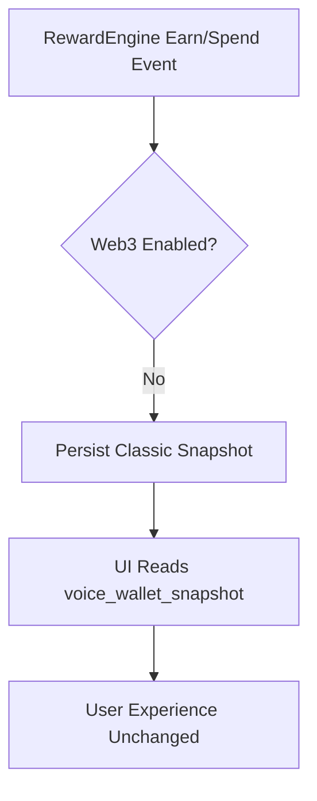
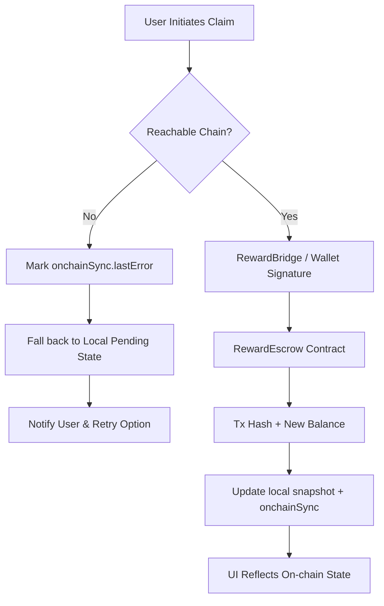

# SafeVoice Web3 Architecture Blueprint

## Overview

SafeVoice is extending its off-chain $VOICE reward engine with on-chain settlement so that community rewards, premium features, and governance can be owned by users. This blueprint defines the target-state architecture, covering network topology, wallet connectivity, contract roles, tokenomics, and the interoperability plan that keeps the existing localStorage-based experience fully backward compatible.

### Goals
- Enable non-custodial ownership of $VOICE while preserving today's anonymous UX.
- Map current RewardEngine actions (claim, spend, staking, NFT issuance) to deterministic on-chain flows.
- Document infrastructure, environment variables, and dependencies so downstream tickets have unambiguous requirements.
- Surface security, compliance, and operational risks early.

### Scope
- Layer-2 network selection and failover strategy.
- Wallet provider strategy (wagmi + RainbowKit + WalletConnect) with SafeVoice guardrails.
- Contract stack (ERC-20 token, reward escrow, spend/burn, staking, NFT badge minter) and role design.
- Tokenomics parameters and governance assumptions for the first 24 months.
- Data architecture for keeping `voice_wallet_snapshot` backward compatible when Web3 is disabled.

### Out of Scope
- Full smart-contract implementations (handled in future tickets).
- UI changes beyond feature flags and configuration bindings.
- Detailed incident response (covered by existing runbooks in `docs/`).

---

## Network Strategy

### Primary Settlement Layer: Arbitrum One (chainId **42161**)
- **Rationale**: Low fees, high throughput, EVM equivalence, strong ecosystem tooling, and existing company expertise (already referenced in `.env` scaffolding).
- **Contract Deployment**: Core token, reward escrow, staking, and governance contracts live on Arbitrum One. Canonical addresses are exposed via environment variables and versioned registry JSON for clients.

### Fallback & Expansion Chains

| Chain | Chain ID | Purpose | RPC Env Var | Notes |
|-------|----------|---------|-------------|-------|
| Polygon PoS | 137 | Primary failover during Arbitrum incidents; regional growth initiatives | `VITE_POLYGON_RPC_URL` | Supports cheap NFT badge minting and mobile-focused wallets. |
| BNB Smart Chain | 56 | Liquidity and CEX bridge compatibility | `VITE_BSC_RPC_URL` | Enabled only for withdrawals/bridging in phase 2. |
| Ethereum Mainnet | 1 | Governance snapshots + treasury custody | `VITE_MAINNET_RPC_URL` | Read-only for most clients; used by relayers and monitoring. |

### Test Networks

| Environment | Chain | Chain ID | Usage |
|-------------|-------|----------|-------|
| Development | Arbitrum Sepolia | 421614 | Default testbed for engineers (matches production L2 semantics). |
| Staging | Polygon Amoy | 80002 | Wallet QA, mobile signers, NFT badge rehearsal. |
| QA / Load | BSC Testnet | 97 | Stress testing staking/burning flows. |

### Chain Selection & Failover Logic
1. On boot, `RewardEngine` queries `VITE_ENABLE_ONCHAIN_REWARDS`.
2. If enabled, Arbitrum One is selected when reachable; otherwise, fallback order is Polygon PoS  BSC based on `VITE_FALLBACK_CHAIN_IDS`.
3. The client persists the most recently successful chain ID in `voice_wallet_snapshot.onchainSync.lastChainId`; this field defaults to `null`, keeping legacy snapshots valid.
4. When all chains fail, the UI automatically demotes to off-chain mode while retaining local transaction history.

Pseudo-code:
```ts
const onchainEnabled = env('VITE_ENABLE_ONCHAIN_REWARDS') === 'true';
const priorityChains = [env('VITE_PRIMARY_CHAIN_ID'), ...env('VITE_FALLBACK_CHAIN_IDS').split(',')];
const selectedChain = onchainEnabled ? pickReachableChain(priorityChains) : null;
```

---

## Wallet & Connectivity Strategy

- **Libraries**: wagmi v1 + viem for low-level RPC, RainbowKit for connectors and UI, WalletConnect v2 for multi-device support.
- **Supported Wallets**: Browser extension wallets (MetaMask, Rabby), WalletConnect QR clients (Rainbow, Zerion), and Safe multisig.
- **Session Handling**: Wallet sessions expire after 5 minutes of inactivity; reconnection prompts re-validate chain ID.
- **Anonymity Preservation**: Wallet connections are optional. Users can interact entirely off-chain until they explicitly opt in.
- **Gas Strategy**: Clients fetch priority fee suggestions from `https://gas.safevoice.app` (to be implemented) and surface warnings when fallback chains are in use.

---

## Environment Variables

| Variable | Description | Required | Default / Notes |
|----------|-------------|----------|-----------------|
| `VITE_ENABLE_ONCHAIN_REWARDS` | Feature flag to toggle Web3 flows globally. | No | Defaults to `false` to preserve current behaviour. |
| `VITE_PRIMARY_CHAIN_ID` | Canonical production chain ID (Arbitrum One = 42161). | Yes (prod) | `42161` |
| `VITE_FALLBACK_CHAIN_IDS` | Comma-separated list of fallback chain IDs (`137,56`). | No | Empty string disables failover. |
| `VITE_WALLETCONNECT_PROJECT_ID` | WalletConnect v2 project identifier. | Yes | Existing variable, now mandatory for Web3 features. |
| `VITE_ARBITRUM_RPC_URL` | Primary Arbitrum RPC endpoint. | Yes (prod/stage) | Should point to Alchemy/Infura/QuickNode or company RPC. |
| `VITE_POLYGON_RPC_URL` | Polygon RPC (fallback). | No | Defaults to public endpoint if omitted. |
| `VITE_BSC_RPC_URL` | BNB Smart Chain RPC (fallback). | No | Required once BSC integration is active. |
| `VITE_REWARD_CONTRACT_ADDRESS` | ERC-20 $VOICE token contract. | Yes (prod/stage) | Matches Hardhat deployments; kept from existing `.env`. |
| `VITE_REWARD_ESCROW_ADDRESS` | Reward escrow contract for claims. | Yes (prod/stage) | New variable. |
| `VITE_SPEND_ROUTER_ADDRESS` | Burn/spend router contract. | Yes when spend->burn is enabled. | New variable. |
| `VITE_STAKING_CONTRACT_ADDRESS` | Staking vault contract. | Yes when staking launches. | New variable. |
| `VITE_BADGE_CONTRACT_ADDRESS` | ERC-1155/721 badge minter. | Yes for NFT issuance. | New variable. |
| `VITE_REWARD_SIGNER_PUBLIC_KEY` | Off-chain signer key used to authorize claim payloads. | Yes | Exposed to client for verification only. |
| `VITE_RELAYER_URL` | HTTPS endpoint for the SafeVoice RewardBridge relayer. | No | When empty, client submits directly via wallet. |
| `VITE_MONITORING_TOPIC` | SNS/Slack topic ID for on-chain alerts. | No | Used by ops dashboards. |

> **Note**: New variables retain the `VITE_` prefix so Vite exposes them at build time. Future tickets must update `.env.example` accordingly.

---

## Smart Contract Landscape

### Contract Inventory

| Contract | Description | Key Functions | Deploys On |
|----------|-------------|---------------|------------|
| `VoiceToken` (ERC-20 + AccessControl + Permit) | Canonical $VOICE token with 1B cap, roles, permit, and pausable bridge flows. | `mint`, `burnFrom`, `bridgeTransfer`, `emergencyPause`. | Arbitrum One, mirrored on Polygon/BSC via bridging. |
| `RewardEscrow` | Holds pending rewards. Mints `VoiceToken` upon claim with signed proofs. | `claim(bytes signature)`, `setSigner`, `pause`. | All supported chains. |
| `SpendRouter` | Burns or redistributes tokens when users spend in-app. | `spend(uint256 amount, bytes32 reason)`. | Arbitrum One (mirrored as needed). |
| `StakingVault` | Handles locking VOICE for yield and moderation privileges. | `stake`, `unstake`, `claimRewards`. | Arbitrum One primary. |
| `BadgeMinter` (ERC-1155) | Issues NFT badges for achievements. | `mintBadge`, `batchMint`, `setURI`. | Polygon PoS primary for lower gas; optional Arbitrum deployment. |
| `TreasuryTimelock` | Manages treasury releases and vesting. | `schedule`, `execute`. | Arbitrum One & Ethereum Mainnet. |
| `GovernanceHub` | Snapshot-compatible aggregator referencing vote weights. | `updateVotingPower`, `queueProposal`. | Arbitrum One. |

### Roles & Permissions

| Role | Granted To | Capabilities | Revocation Path |
|------|------------|--------------|-----------------|
| `DEFAULT_ADMIN_ROLE` | Safe multi-sig (3/5) controlled by founders + security lead. | Manage roles, pause contracts, upgrade proxies. | Governance proposal + timelock. |
| `TREASURY_ROLE` | Treasury wallet (Gnosis Safe). | Withdraw from treasury, top up escrows. | Admin revoke via timelock. |
| `MINTER_ROLE` | RewardBridge relayer + future high-trust backend services. | Call `mint` on `VoiceToken` up to supply cap. | Admin revoke, rotate keys pre-emptively. |
| `BURNER_ROLE` | `SpendRouter` contract. | Call `burnFrom` on `VoiceToken` when spend events occur. | Admin revoke. |
| `BRIDGE_ROLE` | Cross-chain bridge contracts (e.g., LayerZero, Wormhole). | Execute `bridgeTransfer` and `bridgeReceive` for cross-chain operations. | Admin revoke. |
| `SIGNER_ROLE` | Off-chain signer service (CloudHSM). | Produce EIP-712 claim proofs recognized by `RewardEscrow`. | Admin rotate + publish new public key to clients. |
| `PAUSER_ROLE` | Security operations lead. | Emergency pause of RewardEscrow, SpendRouter, StakingVault. | Admin revoke after incident resolution. |
| `UPGRADER_ROLE` | Proxy upgrade guardian (security + product). | Execute vetted upgrades via UUPS pattern. | Admin revoke. |

### Operational Keys & Safeguards
- All privileged roles are controlled via Gnosis Safe accounts with hardware key enforcement.
- Contract upgrades flow through `TreasuryTimelock` (48-hour delay) before executing on Arbitrum.
- Fallback signers (for claim proofs) are stored offline; rotation requires publishing a new `VITE_REWARD_SIGNER_PUBLIC_KEY`.

---

## Off-Chain → On-Chain Flow Mapping

### Claim → Mint
1. RewardEngine accumulates pending rewards in `voice_wallet_snapshot.pending`.
2. User initiates claim. Client requests a signed payload from RewardBridge (or constructs locally with WalletConnect if `VITE_RELAYER_URL` unset).
3. Payload includes user address, amount, nonce, and expiry; signed by `SIGNER_ROLE` key.
4. `RewardEscrow.claim` verifies signature (EIP-712), mints VOICE to user, records event.
5. UI updates local snapshot: `claimed += amount`, `pending = 0`, append on-chain tx hash to `onchainSync.pendingTxHashes`.
6. On success, a webhook updates analytics; on failure, UI reverts to previous snapshot.

### Spend → Burn
1. When user spends tokens (post boost, tips), UI calls `SpendRouter.spend` with reason code.
2. Router pulls tokens via `permit` or pre-approved allowance, burns or transfers to treasury depending on feature.
3. RewardEngine logs spend in local history, referencing tx hash and new balance.
4. In fallback/offline mode, spend is simulated locally and flagged `synced=false` for later reconciliation.

### Staking Flows
1. Users stake VOICE via `StakingVault.stake`. Vault mints receipt NFTs representing stake position.
2. RewardEngine updates `onchainSync.stakingBalance` and adjusts local streak bonuses (staking unlocks higher multipliers).
3. Unstaking triggers cooldown; RewardEngine stores `unstakeAvailableAt` locally so UI works offline.
4. Off-chain moderation privileges read on-chain stake using viem and sync to store.

### NFT Issuance
1. When achievements unlock, RewardEngine emits local event.
2. If Web3 enabled, client calls `BadgeMinter.mintBadge` with `tokenId` derived from achievement code.
3. On Polygon PoS fallback, same flow executes with cheaper gas; addresses stored in `VITE_BADGE_CONTRACT_ADDRESS` (per chain). When Web3 disabled, achievements remain off-chain badges.

---

## Data Flows & Local Storage Compatibility

### Snapshot Schema Evolution
New optional property appended to `WalletSnapshot`:
```json
{
  "totalEarned": 0,
  "pending": 0,
  "balance": 0,
  "transactions": [],
  "onchainSync": {
    "enabled": false,
    "lastChainId": null,
    "lastSyncedBlock": null,
    "pendingTxHashes": [],
    "lastError": null
  }
}
```
- When Web3 is disabled (default), `onchainSync` is either `undefined` or stored with `enabled: false`. Existing snapshots remain valid because RewardEngine defaults missing fields safely.
- Migration adds `onchainSync` lazily only after a successful on-chain interaction, avoiding mutation of legacy-only users.

### Data-Flow Diagram: Compatibility First


### Data-Flow Diagram: Web3 Enabled With Failover


---

## Tokenomics Parameters

### Supply & Caps
- **Max Supply**: 1,000,000,000 VOICE (hard cap enforced in `VoiceToken`).
- **Initial Mint**: 250,000,000 VOICE (25%) to TreasuryTimelock at T0.
- **Emission Schedule**: 15% emitted over 4 years for community rewards with annual reduction (Year1: 6%, Year2: 4%, Year3: 3%, Year4: 2%).
- **Inflation Guardrail**: Cannot exceed +5% net issuance per year without governance approval (enforced by contract-level check).

### Allocation Breakdown

| Pool | Allocation | Vesting | Notes |
|------|------------|---------|-------|
| Community Rewards | 35% (350M) | Dripped via RewardEscrow. | Fuels earn/claim flows; vesting through emission controller. |
| Ecosystem Grants | 15% (150M) | Linear over 36 months. | For partners, ambassadors, hackathons. |
| Team & Advisors | 15% (150M) | 12-month cliff, 36-month linear vest. | Multi-sig custody with cliff enforcement. |
| Treasury Reserve | 20% (200M) | 24-month timelock release. | Treasury operations + liquidity provisioning. |
| Staking Rewards | 10% (100M) | Emitted block-by-block per staking APY schedule. |
| Liquidity Bootstrap | 5% (50M) | Immediate for CEX/DEX listings. |

### Reward Allocation Controls
- RewardEngine fetches daily emission caps from `RewardEscrow`. If the cap is hit, further claims revert; UI displays an honesty notice.
- Spend rebates (e.g., premium subscription rebates) are budgeted from the Staking Rewards pool to avoid overspending community allocations.

### Vesting & Unlock Mechanics
- TreasuryTimelock uses a 48h delay before executing `schedule`d releases.
- Team distribution uses NFT-bound accounts to prevent pre-cliff transfers.
- Governance can reassign unclaimed community rewards after 12 months of inactivity (requires multi-sig + governance vote).

---

## Governance Model Assumptions

1. **Phase 0 (Launch)**: Multi-sig controls `DEFAULT_ADMIN_ROLE`, governance off-chain via core team decisions.
2. **Phase 1 (Delegated Governance)**: VoiceToken extends ERC-20Votes. Users can delegate voting power; proposals executed by multi-sig via timelocked queue. Snapshot + SafeSnap integration assumed.
3. **Phase 2 (Community DAO)**: Threshold of 10,000 unique delegates triggers on-chain proposal execution via Governor contract. Emission parameters become DAO-controlled.
4. **Moderator Council**: Top stakers earn advisory voting rights on content policy updates (non-binding but recorded on Snapshot).

Key assumptions:
- No anonymous direct governance until DAO maturity; Sybil resistance relies on staking weight.
- Emergency veto (security council) exists for 12 months and can only pause, not confiscate funds.

---

## Dependencies & Integration Points

- **RewardBridge Service**: Node.js/TypeScript service issuing claim signatures, tracking rate limits, and pushing events to analytics. Requires HSM integration and access to signer key.
- **RPC Providers**: Dedicated Alchemy/Infura endpoints per chain with failover to public RPC (documented by SRE).
- **Monitoring Stack**: Prometheus + Grafana dashboards ingest contract events; alerts routed via `VITE_MONITORING_TOPIC`.
- **Indexer**: Future ticket to build The Graph/Subsquid indexer for transaction history instead of client polling.
- **Legal & Compliance**: Token distribution & staking rewards must pass legal review before enabling staking (dependency ticket).

---

## Risks & Security Considerations

| Risk | Description | Mitigation |
|------|-------------|------------|
| Signature Abuse | Compromised signer key could mint unbounded rewards. | Store signer key in HSM, rotate frequently, enforce on-chain mint caps. |
| Chain Reorgs | L2 reorgs can orphan claim transactions. | Wait for 20 L2 confirmations before marking claim as final. UI surfaces pending status. |
| RPC Outages | Wallet actions fail if RPC unavailable. | Multi-provider strategy (Alchemy + fallback). Automatic demotion to off-chain mode. |
| Sybil Farming | Anonymous accounts farming rewards. | Require staking threshold for high-value rewards, integrate anti-abuse heuristics into RewardBridge. |
| Contract Upgrades | UUPS proxy misconfiguration could brick token. | Follow `docs/runbook-contract-upgrades.md`, require multi-sig approvals + testnet rehearsal. |
| Cross-Chain Drift | Differing supplies across chains. | Use canonical Arbitrum supply; fallback chains use bridged IOU tokens with daily reconciliation. |
| Regulatory Exposure | Staking + token rewards may trigger securities scrutiny. | Legal review before enabling monetized features; gating by geography if required. |

---

## Open Questions & Next Steps

1. **Badge Standard**: Confirm ERC-1155 vs ERC-721 for achievements (affects metadata + gas estimates).
2. **Spend Router UX**: Decide whether to batch burns via relayer or require direct wallet signatures for each spend.
3. **Relayer Funding**: Establish relayer funding strategy (meta-transactions vs user-pays gas) and document in future ticket.
4. **Analytics Integration**: Choose indexing strategy (The Graph vs in-house) for syncing on-chain transactions to dashboards.
5. **Privacy Extensions**: Evaluate zero-knowledge identity proofs to preserve anonymity while gating sybil attacks.

---

_Reviewed: All critical decisions captured with dependencies and risks surfaced. Future implementation tickets can reference this document for canonical requirements._
